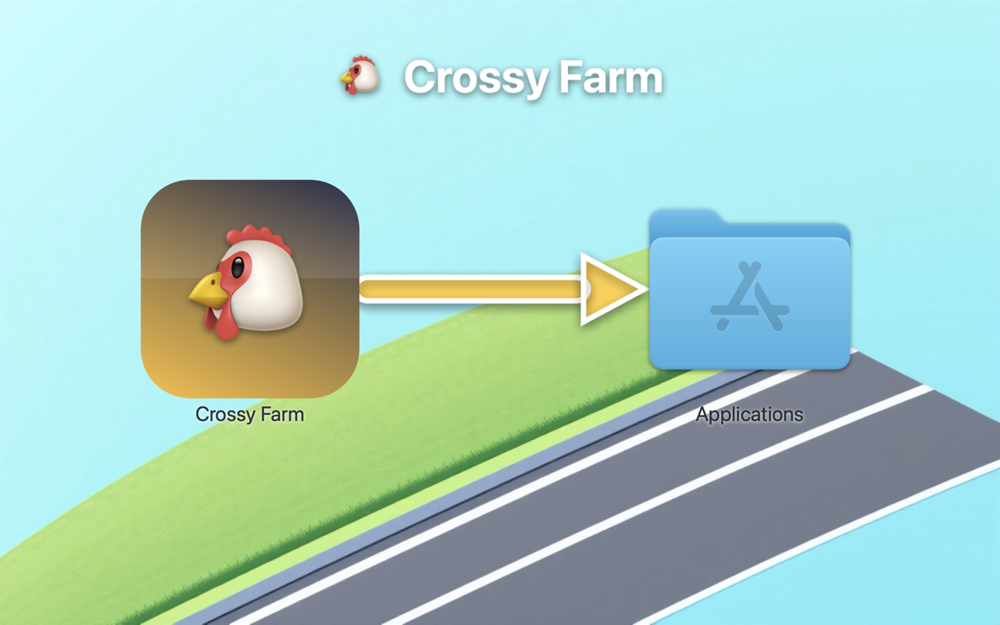
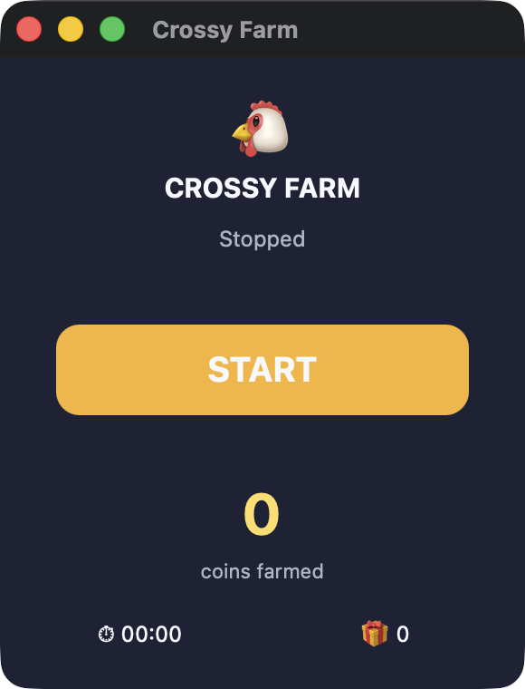

<div align="center">

# 🐔 Crossy Farm

### Auto-farm free coins in **Crossy Road** on macOS — fully AFK

A tiny, dependency-free macOS app that automatically collects the free in-game
reward in Crossy Road every minute, around the clock, while you do something else.

[](https://www.apple.com/macos/)
[](https://support.apple.com/en-us/116943)
[](https://www.python.org/)
[](#how-it-works)
[](LICENSE)

**English** · [Русский](README.ru.md)


<br><br>

<a href="https://github.com/gellermanchik/crossy-road-auto-farm/releases/download/v1.2/Crossy-Farm-1.2.dmg"></a>

<br>
<sub>👆 That's the only file you need to download. Everything else in this repo is just the source code.</sub>

</div>

---

## What is this?

**Crossy Farm** is an auto-clicker / idle bot for the mobile game
[Crossy Road](https://apps.apple.com/app/crossy-road/id924373886) running on a
Mac with Apple Silicon. Crossy Road hands out a free coin reward roughly once a
minute. Doing that by hand all day is mind-numbing — this app does it for you.

It opens the game, plays a throwaway run, dies on purpose, claims the free
reward, returns to the menu, waits out the cooldown, and repeats — forever, until
you click **STOP**. A native control panel shows coins farmed, rewards collected,
and elapsed time.

What makes it nice:

- 🎯 **Truly hands-off.** Start it and walk away. It runs the full loop on its own.
- 🪶 **Zero dependencies.** Pure system Python + Apple frameworks. Nothing to
  `pip install`, no Homebrew packages, no runtime to download.
- 👁️ **Real computer vision.** Uses Apple's on-device Vision OCR to read the
  screen, so it adapts to any window size and position — not fragile fixed pixels.
- 🧹 **Clean stop.** Closing the window kills everything — no background daemons,
  no orphaned processes, no leftover PID files.
- 🌍 **Language-agnostic.** Detects the game's buttons in English and Russian out
  of the box (and is trivial to extend to other languages).

> [!NOTE]
> This is a single-player, offline game with no competitive multiplayer ladder.
> The bot only farms *your own* coins on *your own* device.

---

## ⚠️ Requirements — read this first

| Requirement | Why |
|---|---|
| **Mac with Apple Silicon** (M1/M2/M3/M4…) | Crossy Road runs on Mac only as an iOS app, which requires Apple Silicon. Intel Macs cannot run it. |
| **macOS 11 (Big Sur) or newer** | Needed for the iOS-on-Mac runtime and the Vision framework. |
| **Xcode Command Line Tools** | Provides the system `python3` and `clang`. Install with `xcode-select --install`. |
| **Crossy Road installed** | Get it free from the [App Store](https://apps.apple.com/app/crossy-road/id924373886). On a Mac, look for it under "iPhone & iPad Apps". |
| **The "Remove Ads" purchase** ⭐ | **This is essential.** Without it, the free reward plays a video ad the bot can't skip, breaking the once-a-minute loop. With Remove Ads bought, the reward is granted instantly — and only then can the farm work. |
| **Game language: English or Russian** | The bot reads the game's on-screen text. English and Russian are recognized out of the box; another language just needs two words added to a config (see [Troubleshooting](#my-game-is-in-another-language-and-it-doesnt-detect-the-screens)). |

> [!IMPORTANT]
> **In-game balance is per-device.** Even when you sign in with the same Game
> Center / App Store account on your iPhone and your Mac, Crossy Road keeps a
> **separate coin balance on each device.** Coins you farm on the Mac will *not*
> appear on your phone. This is how the game works — not a bug in this tool. Don't
> waste time trying to "sync" them.

---

## Download & install (easy way)



1. Go to the [**Releases**](https://github.com/gellermanchik/crossy-road-auto-farm/releases/latest) page and download `Crossy-Farm-1.2.dmg`.
2. Open the `.dmg`. A window appears — **drag the 🐔 Crossy Farm icon onto the Applications folder**.
3. On first launch macOS says it *"could not verify"* the app — expected for a free unsigned app. Open it via **System Settings → Privacy & Security → Open Anyway** (see [First launch](#first-launch-apple-could-not-verify) below).
4. Grant the two permissions it asks for (see [Permissions](#grant-permissions)).
5. Click **START**. Done.

> The app is open-source and ad-hoc signed (not paid-notarized by Apple), so the
> first launch needs the one-time **Open Anyway** step. After that it opens normally.

---

## Build from source (transparent way)

If you'd rather build it yourself and read every line first:

```bash
git clone https://github.com/gellermanchik/crossy-road-auto-farm.git
cd crossy-road-auto-farm
./build.sh
```

The app is produced at `dist/Crossy Farm.app`. Drag it to `/Applications` (or run
it in place). To also produce the installer disk image:

```bash
pip3 install dmgbuild     # optional, builds the pretty installer DMG
./package-dmg.sh          # -> dist/Crossy-Farm-1.2.dmg
```

---

## Grant permissions

On first launch macOS asks for two permissions. Both are required — the bot
literally cannot see the game or click without them:

| Permission | What it's for | Where to enable |
|---|---|---|
| **Screen Recording** | To capture the game window and read it with OCR | System Settings → Privacy & Security → Screen Recording |
| **Accessibility** | To move the cursor and send clicks/keys to the game | System Settings → Privacy & Security → Accessibility |

If the farm doesn't react, open those panels, make sure **Crossy Farm** is in the
list and its toggle is **on**, then relaunch the app.

> [!TIP]
> Grant the permissions to **Crossy Farm itself** — not to Terminal. The native
> launcher exists precisely so macOS attaches permissions to the app, not to the
> Python interpreter.

> [!IMPORTANT]
> **After updating the app** (or revoking and re-granting), macOS treats the new
> build as a different app: re-enable both toggles for Crossy Farm and then
> **quit and reopen the app** — permission changes only take effect on a fresh
> launch. Since v1.2, if a permission is missing, clicking **START** tells you
> exactly which one and opens the right settings pane, instead of silently
> spinning with no effect.
>
> **Uninstalling?** Deleting the app leaves its Privacy entries behind (macOS
> doesn't remove them). Clean them up in Terminal:
> ```bash
> tccutil reset ScreenCapture com.crossyfarm.app
> tccutil reset Accessibility com.crossyfarm.app
> ```

---

## How to use

1. Make sure **Remove Ads** is purchased in Crossy Road on this Mac.
2. Launch **Crossy Farm**. The game opens automatically if it isn't already.
3. Click **START**. The panel turns red ("Running") and the counters begin to climb.
4. Click **STOP** (or just close the window) to end. The game stays open; quit it
   yourself with ⌘Q.



### Can I use my Mac while it's farming?

Mostly — yes. Each cycle has a short **active phase** (~10 seconds: it plays a quick
run, dies on purpose, and grabs the reward) during which the cursor moves and the
game has to be in front, so don't fight the mouse for those few seconds. Then comes
a **~1 minute idle wait** for the reward cooldown, and the cursor is all yours —
switch to another app and keep working. When the wait is over, Crossy Farm brings
the game back to the front by itself and collects the next reward. In short: it
works in short bursts once a minute and frees the machine in between.

The window floats on top and is resizable — the bot reads the real window bounds
every cycle, so any size works.

---

## How it works

A small state machine driven by what's on screen:

```
menu ──▶ press orange Play ──▶ hop backwards ×5 (dump the run) ──▶ death screen
                                                                        │
   ┌────────────────────────────────────────────────────────────────────┘
   ▼
claim FREE reward (if the button is blue) ──▶ press orange (back to menu)
   ──▶ wait 61 s for the reward cooldown ──▶ repeat
```

Technical notes, all established empirically:

- **Crossy Road is an iOS app (Unity)** running on Apple Silicon, bundle
  `com.hipsterwhale.crossy`. It is not native Mac software, so its UI tree isn't
  accessible — we work purely from pixels and OCR.
- **Clicks only land via a global `CGEventPost`** that moves the real cursor;
  per-PID events (`CGEventPostToPid`) are ignored by the game. The keyboard works
  too: Down arrow = hop backward, which we use to end a run quickly.
- **Window capture** uses `CGWindowListCreateImage` (hence Screen Recording).
- **Recognition** uses Apple's **Vision** OCR to read button labels at high
  confidence; the orange Play button is found by its golden-orange color, and the
  FREE button's blue-vs-gray tint tells us whether the reward is ready.
- **The control panel is native Cocoa/PyObjC** (Tkinter is broken on modern macOS).
- **Stack:** system `python3` + Quartz + Vision + AppKit only. No third-party packages.

Files (in `src/`):

| File | Role |
|---|---|
| `crossy_lib.py` | Primitives: window capture, click, OCR, button detection |
| `crossy_farm.py` | The engine: `farm_loop()` state machine + CLI fallback |
| `crossy_gui.py` | The native control panel (button, counters, animation) |
| `launcher.c` | Tiny native launcher so TCC permissions bind to the app |
| `Info.plist` | App bundle manifest |

Want to run it from a terminal instead of the GUI (logs in the window)?

```bash
cd "dist/Crossy Farm.app/Contents/Resources"
/usr/bin/python3 crossy_farm.py   # Ctrl+C to stop
```

---

## Troubleshooting

### First launch: "Apple could not verify…"
Expected — the app isn't signed with a *paid* Apple Developer certificate (normal
for free open-source tools; the full source is right here in this repo). On macOS 15
(Sequoia) and macOS 26 (Tahoe) the old "right-click → Open" trick is gone, so:

1. Double-click the app once — you'll see the warning. Click **Done** (not "Move to Trash").
2. Open **System Settings → Privacy & Security**.
3. Scroll to the **Security** section: you'll see *"Crossy Farm.app was blocked…"* with an **Open Anyway** button.
4. Click **Open Anyway**, confirm with Touch ID / password.
5. The app launches and never asks again.

One-line alternative in Terminal (removes the download quarantine flag):
```bash
xattr -dr com.apple.quarantine "/Applications/Crossy Farm.app"
```

Removing the warning for *everyone* would need a paid Apple Developer ID ($99/year)
to sign + notarize the app — overkill for a free tool, so it isn't done.

### "clang not found" / `python3` triggers an install prompt
Install the Command Line Tools and retry:
```bash
xcode-select --install
```

### The farm starts but never collects anything
- Confirm **Remove Ads** is purchased — otherwise the reward shows an unskippable ad.
- Confirm both **Screen Recording** and **Accessibility** are enabled for Crossy Farm, then relaunch.
- Make sure the Crossy Road window is fully visible (not minimized or behind another window).

### My game is in another language and it doesn't detect the screens
Add your language's words for the death-screen rank label and the free-reward
button to `DEATH_MARKERS` / `FREE_MARKERS` at the top of `src/crossy_farm.py`,
then rebuild. PRs welcome.

### Coins aren't showing up on my phone
Expected — see the per-device balance note in [Requirements](#️-requirements--read-this-first).

---

## FAQ

**Is this a cheat / will I get banned?**
Crossy Road is a single-player, offline game with no competitive online ladder.
The bot only automates collecting *your own* free reward on *your own* device.
There's no other player to affect. That said, automation may technically violate
the game's Terms of Service — use it at your own discretion.

**Does it need the internet or send my data anywhere?**
No. Everything runs locally on your Mac. There is no network code at all.

**Will it slow down my Mac?**
It's idle most of the time (waiting out the 61-second cooldown) and uses on-device
Vision OCR for a fraction of a second per cycle. Impact is negligible.

---

## Disclaimer

This project is an independent, educational automation tool. It is **not**
affiliated with, endorsed by, or connected to Hipster Whale or the makers of
Crossy Road. "Crossy Road" is a trademark of its respective owner. Use of game
automation may violate the game's Terms of Service; you use this software at your
own risk. Provided "as is" without warranty of any kind.

---

## License

[MIT](LICENSE) — do whatever you want, just keep the notice.

<div align="center">
<sub>Made for fun. If it saved you an hour of tapping, ⭐ the repo.</sub>
</div>
